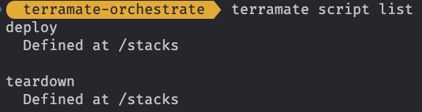
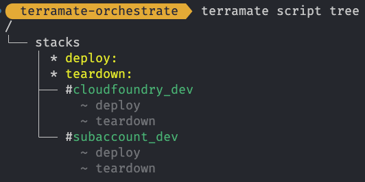
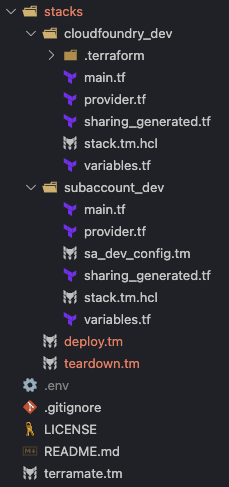

# Experimenting with Terramate and SAP BTP

## The Challenge

In case you are working with Terraform in a multi-provider setup you certainly also came across the following challenge:

You want to create a resource 1 that depends on provider A and a resource 2 that depends on provider B. So far, so good, but the read-only data of resource 1 contains parts of the information that is needed to configure provider B. Resource 2 has a dependency to resource 1, so from a logical perspective things should work out, as from a runtime perspective provider B is needed once resource 1 and consequently all relevant information needed for the configuration is available.

Unfortunately, Terraform as well as OpenTofu require the provider configuration fully in place from the start. A dynamic configuration or a lazy loading of the provider configuration is not available, and I did not come across any plans to provide such a functionality.

In this blog post I want to present a possible solution leveraging Terramate. As an example, I will be using one example from my "daily life" namely SAP BTP and the Cloud Foundry environment on SAP BTP. This setup matches the above challenge:

The Cloud Foundry environment (namely the organization) can be created via the Terraform provider for SAP BTP. *After* the creation, we have access to the data relevant for authenticating against the Cloud Foundry provider namely the API endpoint of the environment. In addition, we need another information namely the ID of the Cloud Foundry organization to setup further resources in Cloud Foundry.

So, jackpot ... this is a challenge and it is for real. Let's see how we can resolve it

## Status Quo

Currently if you want to resolve the situation, you must execute Terraform in two steps:

1. Setup the Cloud Foundry environment via the Terraform Provider for SAP BTP and define the relevant values as output.
2. Do the consequent setup in Cloud Foundry via a second Configuration, transferring the output from the first step to the second one.

While this is doable n CI/CD pipelines like GitHub Actions, testing things locally gets painful. As a workaround you can write the output of step 1 to a `terraform.tfvars` file of step 2, which gives some level of convenience, but with this setup the setup in the CI/CD scenario probably differs from your local setup which is also not desirable.

This is where I think Terramate can help a bit. Although it cannot do some black magic and make things work as we would love them to, you can get a more streamlined setup. What do we need for that? Let's first explore some (experimental) features of Terramate that can help us.

## Terramate (Experimental) Features

Terramate as a productivity tool on top of Terraform (or OpenTofu) can support you with the orchestration of the Terraform flow. Our recipe contains the following ingredients:

- [Stacks](https://terramate.io/docs/cli/stacks/) which we will use to define self-contained units for the deployment
- [Explicit Order of Execution](https://terramate.io/docs/cli/orchestration/order-of-execution#explicit-order-of-execution) which we sue to ensure that in case of a full deployment the self-contained units are executed in the right sequence
- [Outputs Sharing](https://terramate.io/docs/cli/orchestration/outputs-sharing)(experimental) for transferring the output of one stack to the dependent one
- [Scripts](https://terramate.io/docs/cli/orchestration/scripts#running-scripts)(experimental) to split the Terraform specific commands from the Terramate commands and to avoid multiple Terramate commands to be keyed in.

As you can see we will leverage some experimental features which are "*new and experimental feature that might still be subject to changes in the future.*". We love to live on the edge of new features, so we accept that, right?

Now let's see how we can bring these ingredients together.

## Terramating the Experience of SAP BTP and Cloud Foundry

Let us shortly recap the setup that we plan to have:

- On the SAP BTP side of the house we first want to setup a [subaccount](https://registry.terraform.io/providers/SAP/btp/latest/docs/resources/subaccount) and an [envrionment](https://registry.terraform.io/providers/SAP/btp/latest/docs/resources/subaccount_environment_instance) of type Cloud Foundry. This is done via the Terraform provider for [SAP BTP](https://registry.terraform.io/providers/SAP/btp/latest).
- After that we want to create a [space](https://registry.terraform.io/providers/SAP/cloudfoundry/latest/docs/resources/space) in the Cloud Foundry environment and if applicable assign some [space roles](https://registry.terraform.io/providers/SAP/cloudfoundry/latest/docs/resources/space_role). This is done via the [Terraform provider for ≈Cloud Foundry](https://registry.terraform.io/providers/SAP/cloudfoundry/latest) that needs the output of the previous setup for the configuration.

The code samples that you will see, will focus on the features mentioned above. I did not use the code generation feature of Terramate to avoid distracting from the main topics of this blog post. Having said that, you would probably add code generation to setup when bringing things to production.

### Defining the stack

First thing we need to do is define the Terramate stacks. The kind of natural split is to have one stack fort the subaccount setup and one for the Cloud Foundry setup. We achieve this via:

```bash
terramate create --name "subacccount-dev" --description "Basics for BTP development setup" --tags "subaccount,dev" stacks/subaccount_dev
terramate create --name "cloudfoundry-dev" --description "CF for BTP dev setup" --tags "cloudfoundry,dev" stacks/cloudfoundry_dev
```

This results in this directory structure:

```bash
| - stacks
|   | - subacount_dev
|   | - cloudfoundry_dev
```

Each of the stacks contains the stack information in the `stack.tm.hcl` file. Excellent. Let's move on to the execution order.

### Defining the execution order

Both stacks are on the same level, so no implicit dependency and consequently no order is defined. Nevertheless, we would like to have such an order without defining sub-stacks. Luckily Terramate offers an option to explicitly configure the order of execution via the `after` block in the stack definition. As we want to instruct Terramate to execute the Cloud Foundry stack after the subaccount stack, we adjust the `stack.tm.hcl` file accordingly:

```terraform
stack {
  name        = "cloudfoundry-dev"
  description = "CF for BTP dev setup"
  tags        = ["cloudfoundry", "dev"]
  id          = "d5962b3f-3b79-412f-9970-93112741855a"
  after       = ["tag:subaccount:dev"]
}
```

 You can specify the `after` block via tags as we did or via the path to the stack. Using the tags is considered as best practice and keeps you more flexible and future-proof from my perspective. We can validate the sequence via the command:

 ```bash
 terramate list --run-order
 ```
 With that we can add the configuration for the setup.

### The Terraform configuration

I do not want to clutter this blog post with a lot of basic Terraform code, so the following snippets focus on the main bits and pieces of our storyline. You find the complete code on [GitHub](https://github.com/btp-automation-scenarios/terramate-orchestrate).

In the `subaccount_dev` stack we define the resources as well as the provider configuration as "usual". Although we need to define an output for the configuration to get access to the API as well as to the organization ID of the Cloud Foundry environment, we do not do that manually. Terramate will close the gap here. For a better understanding of the following code snippets, this is the `main.tf` of the subaccount stack:

```terraform
resource "random_uuid" "uuid" {}

locals {
  random_uuid       = random_uuid.uuid.result
  subaccount_domain = lower("${var.subaccount_name}-${local.random_uuid}")
  subaccount_name   = var.subaccount_name
  subaccount_cf_org = substr(replace("${local.subaccount_domain}", "-", ""), 0, 32)
}

resource "btp_subaccount" "sa_dev_base" {
  name      = var.subaccount_name
  subdomain = join("-", ["sa-dev-base", random_uuid.uuid.result])
  region    = lower(var.region)
}

# Fetch all available environments for the subaccount
data "btp_subaccount_environments" "all" {
  subaccount_id = btp_subaccount.sa_dev_base.id
}

# Take the landscape label from the first CF environment if no environment label is provided
resource "terraform_data" "cf_landscape_label" {
  input = [for env in data.btp_subaccount_environments.all.values : env if env.service_name == "cloudfoundry" && env.environment_type == "cloudfoundry"][0].landscape_label
}

# Create the Cloud Foundry environment instance
resource "btp_subaccount_environment_instance" "cfenv_dev_base" {
  subaccount_id    = btp_subaccount.sa_dev_base.id
  name             = local.subaccount_cf_org
  environment_type = "cloudfoundry"
  service_name     = "cloudfoundry"
  plan_name        = var.cf_plan_name
  landscape_label  = terraform_data.cf_landscape_label.output

  parameters = jsonencode({
    instance_name = local.subaccount_cf_org
  })
}
```
The resource of interest is the `btp_subaccount_environment_instance` which delivers the necessary information for the other stack.

When it comes to the `cloudfoundry_dev` stack, we also define the project with the usual structure, a `main.tf` with the space creation and the space role assignment:

```terraform
resource "cloudfoundry_space" "dev_space" {
  name = var.cf_space_name
  org  = var.cf_org_id
}

resource "cloudfoundry_space_role" "space_developer" {
  for_each = toset(var.cf_space_developers)
  username = each.value
  type     = "space_developer"
  space    = cloudfoundry_space.dev_space.id
}

resource "cloudfoundry_space_role" "space_manager" {
  for_each = toset(var.cf_space_managers)
  username = each.value
  type     = "space_manager"
  space    = cloudfoundry_space.dev_space.id
}
```

and a provider configuration that looks like this:

```terraform
terraform {
  required_providers {
    cloudfoundry = {
      source  = "sap/cloudfoundry"
      version = "1.0.0-rc1"
    }
  }
}

provider "cloudfoundry" {
  api_url = var.cf_api_url
}
```

We see that the API URL in the provider configuration as well as the Cloud Foundry org ID is a variable (`var.cf_api_url` and `var.cf_org_id`). Defining the variables is a bit counterintuitive now. As for the outputs in the other stack we leave these two variables out of the `variables.tf` file which looks like this:

```terraform
variable "cf_space_name" {
  type        = string
  description = "The name of the Cloud Foundry space."
  default     = "dev"
}

variable "cf_space_managers" {
  type        = list(string)
  description = "List of managers for the Cloud Foundry space."
  default     = []
}

variable "cf_space_developers" {
  type        = list(string)
  description = "List of developers for the Cloud Foundry space."
  default     = []
}
```

As for the outputs this looks weird at a first glance (and also at a second glance) but as the configuration is in place, we can define the necessary bits and pieces for the output sharing.

### Sharing the Output between stacks

Now we sparkle some Terramate magic dust into the stacks to connect the output of the `subaccount_dev` stack with the `cloudfoundry_dev` stack.

As a first step we need to define a backend (not to mix up with a remote backend of Terraform) for the sharing. To do so we create a file called `terramate.tm` at the *root level* (= one level above the stack directories) with the following content:

```terraform
terramate {
  config {
    experiments = [
      "outputs-sharing"
    ]
  }
}

sharing_backend "default" {
  type     = terraform
  filename = "sharing_generated.tf"
  command  = ["terraform", "output", "-json"]
}
```

The `config` block advices Terramate to enable the experimental feature of output sharing. The `sharing_backend` block defines which filename should be used to generate the content for the sharing namely the variables as well as the output via the `filename` attribute. The `command` attribute specifies the command Terramate should use to access the output. It's the usual suspect when it comes to outputs of Terraform.

Next, we configure Terramate what is the *output* that should be shared. We achieve this by adding a configuration inside of the `subaccount_dev` stack that we call `sa_dev_config.tm` with the following content:

```terramate
output "cf_api_url" {
  backend   = "default"
  value     = "${jsondecode(btp_subaccount_environment_instance.cfenv_dev_base.labels)["API Endpoint"]}"
  sensitive = false
}

output "cf_org_id" {
  backend   = "default"
  value     = btp_subaccount_environment_instance.cfenv_dev_base.platform_id
  sensitive = false
}
```

In a nutshell we define the output variables of the stack via `output` blocks. The configuration tells Terramate which `backend` to use (the `default` one we created before), the `value` of the output as well as the sensitivity of the value.

As a counterpart we define the missing variables in the `cloudfoundry_dev` stack via the file `cf_dev_config.tm` inside of the stack directory:

```Terraform
input "cf_api_url" {
  backend       = "default"
  from_stack_id = "ca4662d3-b75d-4290-9842-5bb8ef924d97"
  value         = outputs.cf_api_url.value
}

input "cf_org_id" {
  backend       = "default"
  from_stack_id = "ca4662d3-b75d-4290-9842-5bb8ef924d97"
  value         = outputs.cf_org_id.value
}
```

As expected, we use `input` blocks or the definition. Besides the `backend` we specify the ID of the stack where the values come from (`from_stack_id`) as well as the `value`. Beware that we are using `terraform output -json`, so we must reference the attribute of the JSON object as value.

With that we are good to go and can start the code generation of Terramate via:

```bash
terramate generate
```

As a result, a new file will appear in the stacks named `sharing_generated.tf`. This corresponds to our configuration and the content of the files closes the gap of the Terraform configuration of the step before by creating the missing output

```terraform
// TERRAMATE: GENERATED AUTOMATICALLY DO NOT EDIT

output "cf_api_url" {
  value = "${jsondecode(btp_subaccount_environment_instance.cfenv_dev_base.labels)["API Endpoint"]}"
}
output "cf_org_id" {
  value = btp_subaccount_environment_instance.cfenv_dev_base.platform_id
}
```

and input:

```terraform
// TERRAMATE: GENERATED AUTOMATICALLY DO NOT EDIT

variable "cf_api_url" {
  type = string
}
variable "cf_org_id" {
  type = string
}
```

From a configuration perspective we are complete. Now we need to execute Terramate i.e. use Terramate to execute Terraform.

### Script it!

Taking one step back, our goal is to automate the provisioning flow which means issue several Terraform commands. We do not want to do that manually one command at a time but want to have a pre-defined flow for setting up and also tearing down the infrastructure. Again, Terramate offers a solution for that namely using scripts.

As the scripting is still in experimental stage, we must activate it in the already existing configuration in the `terramate.tm` file. We add the value `scripts` to the `experiments` list, so the file now looks like this:

```terraform
terramate {
  config {
    experiments = [
      "outputs-sharing",
      "scripts"
    ]
  }
}

sharing_backend "default" {
  type     = terraform
  filename = "sharing_generated.tf"
  command  = ["terraform", "output", "-json"]
}
```

Next, we define the two scripts. We call them `deploy.tm` and `teardown.tm` and we store them in the `stacks` directory.

The `deploy.tm` contains the command flow from initialization, validation, planning and applying of the Terraform configuration. According to the Terramate documentation the file has the following structure:

```terraform
script "deploy" {
  job {
    name        = "Terraform Deployment"
    description = "Init, validate, plan, and apply Terraform changes."
    commands = [
      ["terraform", "init"],
      ["terraform", "validate"],
      ["terraform", "plan", "-out", "out.tfplan", "-lock=false", {
        enable_sharing = true
      }],
      ["terraform", "apply", "-input=false", "-auto-approve", "-lock-timeout=5m", "out.tfplan", {
        enable_sharing = true
      }],
    ]
  }
}
```

The structure is intuitive and consistent with other objects in Terramate. The only thing that must not be forgotten is to add the option that the output sharing is enabled when executing the commands via `enable_sharing = true`.

The script for the teardown follows the same logic and looks like this:

```terraform
script "teardown" {
  job {
    name        = "Terraform Teardown"
    description = "Destroy Terraform setup."
    commands = [
      ["terraform", "destroy", "-input=false", "-auto-approve", "-lock-timeout=5m", {
        enable_sharing = true
      }],
    ]
  }
}
```

Let us first check if we did things correctly and Terramate finds the scripts. We do so via

```bash
terramate script list
```

The output should look like this:



Looks good. Now let us check where the scripts can be applied based on their location in the directories. We do so via the following command:

```bash
terramate script tree
```

The output looks like this:



Also looks good. The scripts can be applied to our stacks.

The directory structure with all the implementations in place looks like this:



### 3, 2, 1 ... and Action

The basic challenge of the dependency remains, so we cannot spin up everything with one single command. The advantage of this setup is that we can now do a sequence of consistent and thanks to scripting short Terramate commands to make things happen, without worrying about dependencies and propagating the right data from one stack to another. In addition, the setup remains unchanged no matter if we are running locally or in a CI/CD pipeline which makes debugging much easier.

Let's bring all the bits and pieces together and spin up the infrastructure with the following commands (and don't forget to set your authentication information for SAP BTP and Cloud Foundry before):

```bash
terramate script run -X --tags=subaccount:dev deploy
```
The very first run needs to be restricted to the subaccount as the Cloud Foundry environment needs to be created. After that we can process everything via:

```bash
terramate script run -X deploy
```

After that you will have all the desired resources up and running on SAP BTP. The combined output of Terramate and Terraform in the console tells exactly what happened and helps a lot if you are running into issues.

> **Note** I use the `-X` option as I am lazy and do not want to commit every time, I do some changes or fixes when trying things out. In a productive setup I would not recommend that

We can now also tear things down via the second script:

```bash
terramate script run -X --reverse teardown
```

Mind the `--reverse` as otherwise things might get funny (I never forget something like that ... I heard of people doing so but not me ;-) ).

And that's it, we did it!

## Where to find the code

If you want to take a closer look at the code, you find it on GitHub in this [repository](https://github.com/btp-automation-scenarios/terramate-orchestrate).

## Summary

Overall, we must state there is no perfect way to solve the challenge we mentioned in the beginning. This is due to the way how Terraform works. One could work around this dependency issues for the provider configuration but is always cumbersome and often leads to solutions that work differently when trying things out locally compared to CI/CD pipelines.

My impression is that Terramate can help us with the setup to make it concise and at least from a user perspective more streamlined. The experimental feature of output sharing as well as scripts support us in making our challenge more manageable and end up with a at least from my perspective clean and understandable solution following the paradigm of stacks that I think is a huge strength of Terramate.

As we are using experimental features there are some points that could be improved from a documentation perspective. I could figure out everything after some time, but I think the documentation of the output sharing as well as the one for scripts might need some more love before making them GA.

What also caused some confusion is that the VS Code plugin marked the files using the experimental syntax as having errors. The corresponding error message in the pop-up really helps you with figuring out if something is missing, but I would have expected that it also recognizes the overall configuration. Not a big thing though as you can validate the setup via the Terramate commands to see if everything is where and how it should be.

As the features still evolve it would be great if the scripts feature would also support filtering for tags inside of the script. That would streamline the setup even more.

With that happy Terraforming and Terramating!
